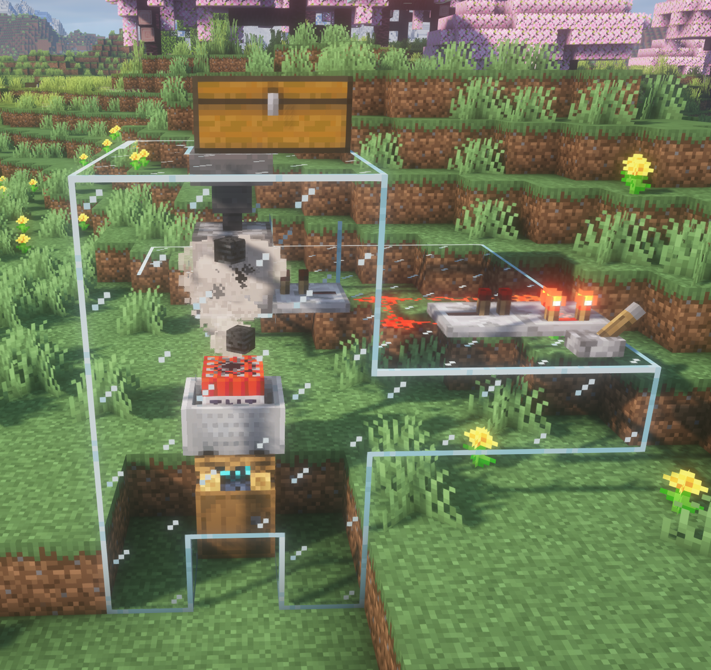
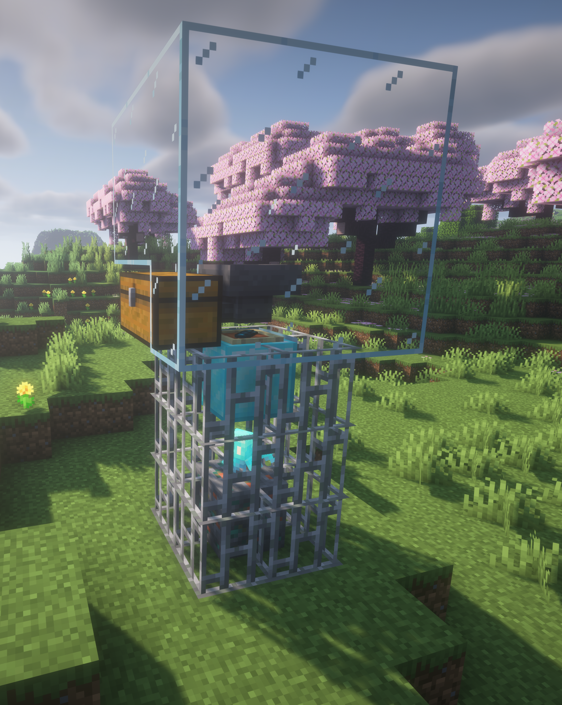

# Cabra's Vanilla Automation
Hey there! This Cabra's Vanilla Automation, a datapack for minecraft, tested and working on **1.20.1**, which adds neat automation tweaks to minecraft while staying vanilla-friendly. I tried to extend vanilla mobs with cool automation functionality, some useful for every game, some for modded minecraft and some are just fun to play with. See the [Feature List](#feature) and [FAQ](#FAQ)

## FAQ

### Where can I download the pack?
The latest zipped datapack file will be available for download at the [Releases](https://github.com/cabraviva/Cabras-Vanilla-Automation/releases) page. If you don't know how to install my pack, just watch a [tutorial](https://www.youtube.com/results?search_query=minecraft+install+datapack).

### Why a datapack?
I chose making this a datapack because I wanted these automation features to be easy to maintain and usable in every minecraft instance, no matter whether you are using forge, fabric or vanilla. Also, datapacks are serverside and no other player has to install it to work.

  
See more...

### Can I request a feature?
Sure, go ahead and create an issue on my [GitHub Page](https://github.com/cabraviva/Cabras-Vanilla-Automation). But I would be thankful, if you have experience making datapacks, if you were able to just create a pull request adding the functionality.

### Can I share your datapack?
Yes, you definitely can! This pack is licensed under the MIT, or in simple terms, you may share, change, publish and sell this datapack without asking for permission.

## Features

### Implemented

#### Block farming using sniffers

  
Expand

Sniffers are now able to dig for blocks, if they stand directly on them. Every 30 seconds, 2 items will be dropped. You can collect those via hopper minecarts.
 
**Currently following blocks are supported**:
- Sand
- Red sand
- Granite
- Diorite
- Andesite
- Gravel
- Dirt

#### Extremely efficient strider lava farm

  
Expand

A farm built exactly like shown in the image, allows you to input empty buckets in the top chest, which will be filled up with lava and are spit out in the bottom chest. It requires a strider in a 3x3x3 block lava source (in any dimension), which can not move. The farm produces one lava bucket per tick, but only while empty buckets are present. You can put multiple striders in one farm, but this will have no result, so if you need more lava, please create a second farm. Your new lava farm can be used to provide fuel for furnaces or even other mods, or create an obsidian generator, which you sadly can't fully automate by now, but there are cool mods for this like RedstoneBits which add a breaker block. And yes, you can build dripstone lava farms, but they are large and not very efficient. This farm not only is much more useful, but also adds an actual use case for the strider mob in the late game phase.

#### Simple wither farm

  
Expand

Building a structure like shown in the image, will result in a tiny, simple wither farm. It does not need soul sand, but requires 3 wither skulls to drop one nether star and one wither rose. Those will be inserted in the barrel below the soul campfire. To build the farm, you need to place a tnt minecart on a soul campfire. Underneath place a barrel. Now, you can either drop the skulls manually on top of the campfire, or use a dropper and a redstone clock to fully automate this process.

#### Allay Ore Farm

  
Expand

Building a structure like shown in the image, will result in a tiny, simple farm intended for ores. The item frame has to include one echo shard and will sit on top of a diamond block. The farm will generate one drop every 2 minutes. NOTE: This farm will not only farm ores, but can technically duplicate any block and even item with the use of shulker chests. So please make sure you set yourself rules on how and with which blocks you want to use this farm. I would only use it with cheap materials like copper, redstone, gold and maybe diamonds.

### Planned
 - Automated trading with some villagers
 - Farming diamonds using allays
 - Farm dye easily
 - Easy village breeding
 - Remote item pipeline
 - Adding more use to turtles, axolotls, bees and foxes
 - Maybe automating elytras (has to be really expensive to make)
 - Everything you guys request
